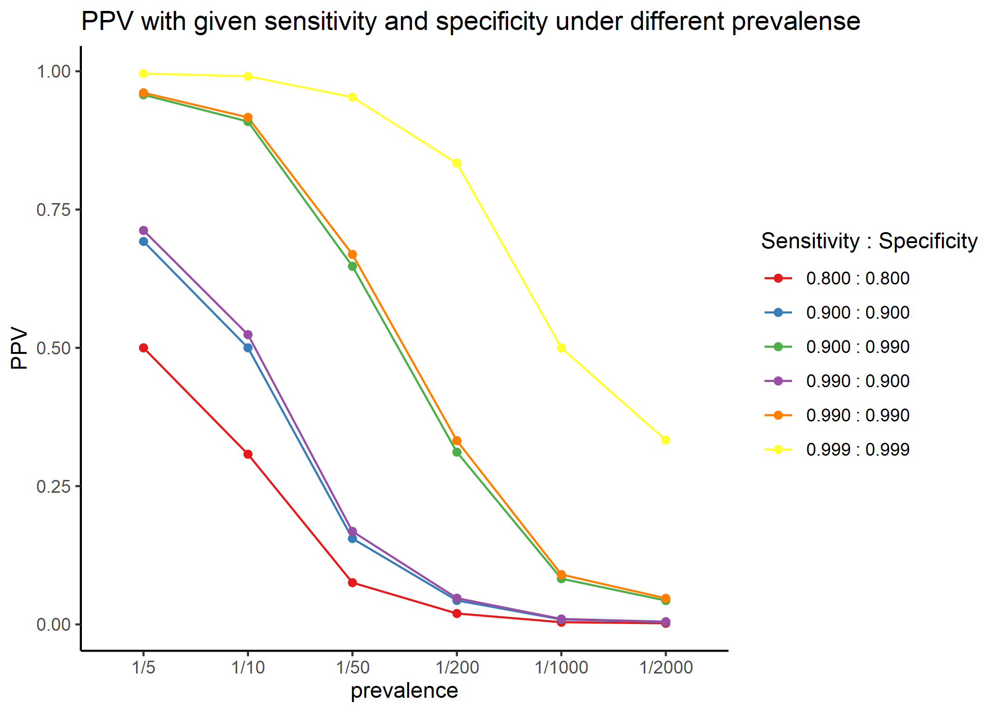

PPV calculator for diagnostic tests with given sensitivity and specificity under different prevalense rate


```r
require(tidyverse)
require(magrittr)
require(ggplot2)
```

PPV = n_TP / (n_TP + n_FP)   
    = (sensitivity * n_POS) / {(sensitivity * n_POS) + (1 - specifisity) * n_NEG}  
    = (sensitivity * prevalence * pop_size) / {(sensitivity * prevalence * pop_size) + (1 - specifisity) * (1 - prevalence) * pop_size}    
    = (sensitivity * prevalence) / {(sensitivity * prevalence) + (1 - specifisity) * (1 - prevalence)}    


```r
getPPV <- function(sensitivity = 0.9, specifisity = 0.9, prevalence = 0.1, pop_size = 100000) {
  n_POS <-      prevalence  * pop_size
  n_NEG <- (1 - prevalence) * pop_size
  
  n_TP <- sensitivity     * n_POS
  n_FP <- (1 - specifisity) * n_NEG  # n_NEG - n_TN = n_NEG - specifisity * n_NEG
  
  PPV <- n_TP / (n_TP + n_FP) 
  return(PPV)
}
```


```r
getPPV(sensitivity = 0.8, specifisity = 0.8, prevalence = 1 / 5)
## [1] 0.5
getPPV(sensitivity = 0.9, specifisity = 0.9, prevalence = 1 / 10)
## [1] 0.5
getPPV(sensitivity = .99, specifisity = .99, prevalence = 1 /100)
## [1] 0.5
```


```r
drawPPV <- function(performance = list(c(sensitivity = 0.9, specifisity = 0.9)),
                    prevalences = c("1/5", "1/10", "1/50", "1/200", "1/1000", "1/2000", "1/10000")) {
  ppvs <- data.frame(NULL)

  for(i in 1:length(performance)) {
    this <- performance[[i]]
    for (p in prevalences) {
      ep <- eval(parse(text = p))
      
      this_ppvs <- data.frame(
        sensitivity = this["sensitivity"], 
        specifisity   = this["specifisity"], 
        prevalence  = p, 
        PPV = getPPV(
          sensitivity = this["sensitivity"],
          specifisity = this["specifisity"],
          prevalence = ep
        )
      )
      # print(this_ppvs)  
      ppvs <- rbind(ppvs, this_ppvs)
    }
  }
  rownames(ppvs) <- NULL
  ppvs$Sens_vs_Spec <- factor(sprintf("%.03f : %.03f", ppvs$sensitivity, ppvs$specifisity))
  ppvs
}
```


```r
res <- drawPPV()
str(res)
## 'data.frame':	7 obs. of  5 variables:
##  $ sensitivity : num  0.9 0.9 0.9 0.9 0.9 0.9 0.9
##  $ specifisity : num  0.9 0.9 0.9 0.9 0.9 0.9 0.9
##  $ prevalence  : Factor w/ 7 levels "1/5","1/10","1/50",..: 1 2 3 4 5 6 7
##  $ PPV         : num  0.69231 0.5 0.15517 0.04327 0.00893 ...
##  $ Sens_vs_Spec: Factor w/ 1 level "0.900 : 0.900": 1 1 1 1 1 1 1
```


```r
pc <- list(
  c(sensitivity = 0.8, specifisity = 0.8),
  c(sensitivity = 0.9, specifisity = 0.9),
  c(sensitivity = 0.99, specifisity = 0.9),
  c(sensitivity = 0.99, specifisity = 0.99),
  c(sensitivity = 0.999, specifisity = 0.999)
)
dp <- drawPPV(performance = pc)
str(dp)
## 'data.frame':	35 obs. of  5 variables:
##  $ sensitivity : num  0.8 0.8 0.8 0.8 0.8 0.8 0.8 0.9 0.9 0.9 ...
##  $ specifisity : num  0.8 0.8 0.8 0.8 0.8 0.8 0.8 0.9 0.9 0.9 ...
##  $ prevalence  : Factor w/ 7 levels "1/5","1/10","1/50",..: 1 2 3 4 5 6 7 1 2 3 ...
##  $ PPV         : num  0.5 0.30769 0.07547 0.0197 0.00399 ...
##  $ Sens_vs_Spec: Factor w/ 5 levels "0.800 : 0.800",..: 1 1 1 1 1 1 1 2 2 2 ...
gg <- ggplot(dp, aes(x = prevalence, y = PPV, colour = Sens_vs_Spec, group = Sens_vs_Spec)) +
  geom_line() +
  geom_point() +
  labs(title = "PPV with given sensitivity and specificity under different prevalense",
       color = "Sensitivity : Specificity") +
  theme_classic()

export::graph2png(gg, file = "compare.png")
## Exported graph as compare.png
```




